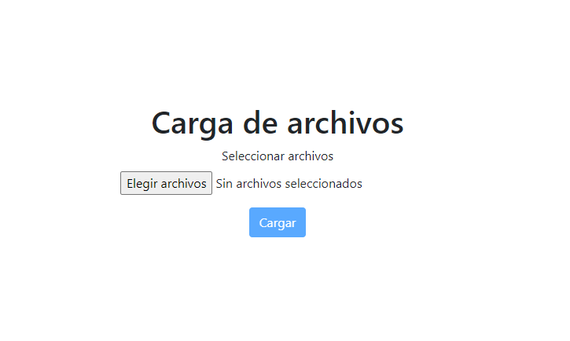
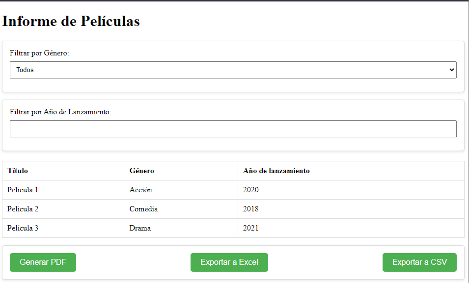

  # Backend

  ## Iniciar Proyecto
  ```
    npm install -g pnpm
  ```
  ```
    pnpm init
  ```

  ## Instalar Dependencias
  ```
    pnpm install express multer ejs path
  ```

  ## Iniciar Proyecto
  ```
    pnpm start
  ```
  
  
  # Frontend
  ## Instalar Cliente
  ```
    npm install -g @angular/cli@16.2.1
  ```
  ## Dependencias
  ```
    npm init -y
  ```
  ```
    npm install pdfmake –save
  ```
  ```
    npm install @types/pdfmake --save-dev
  ```
  ```
    npm install xlsx papaparse
  ```



